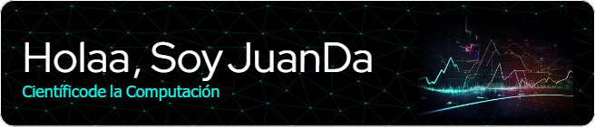

***Hola, soy Juan David Barragan, Estudiante de la Computación.*** 

 

## ⚡datos rapidos sobre mi:
- 🌱 Estoy aprendiendo nuevas técnicas de **Análisis y visualización de Datos**
- 🔭 Estoy implementando modelos matemáticos de **Machine Learning**
- 📫 Contacto: Jubarragana@unal.edu.co

- 🔭 I’m currently working on ...
- 🌱 I’m currently learning ...
- 👯 I’m looking to collaborate on ...
- 🤔 I’m looking for help with ...
- 💬 Ask me about ...
- 📫 How to reach me: ...
- 😄 Pronouns: ...
- ⚡ Fun fact: ...
-->
